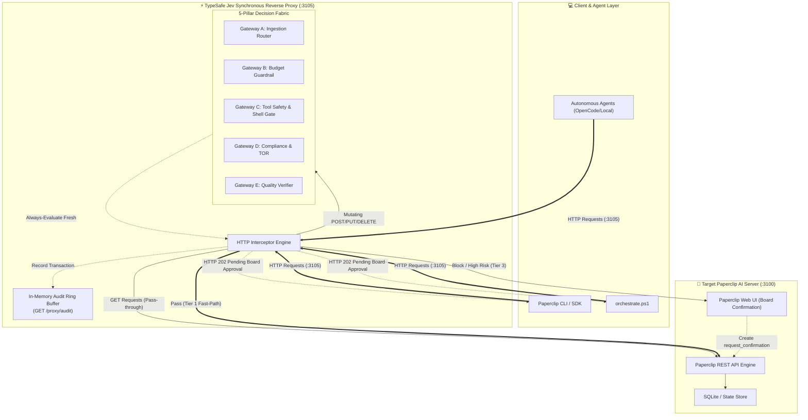
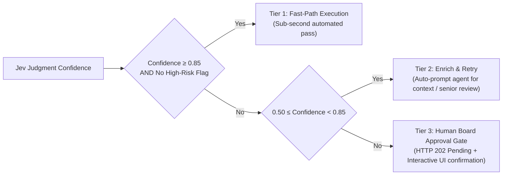

# JevEngineer: System 1 Decision Fabric & Multi-Agent Orchestrator

[](#automated-testing)
[](#5-pillar-decision-mesh)
[](#dual-ai-engine-architecture)
[](#enterprise-organization-structure)
[](LICENSE)

**JevEngineer** is an enterprise-grade AI orchestration and decision control plane designed for **Paperclip AI**. Powered by **TypeSafe AI's flagship Jev model**, it introduces a horizontal **System 1 Reflex Layer** across the enterprise, replacing fragile, slow, and expensive LLM prompt-and-parse loops with typed, calibrated, sub-second judgments (`Choice`, `Noul`, `Score`).

---

## 🏛️ Enterprise Architecture



---

## ⚡ System 1 Decision Fabric (5-Pillar Decision Mesh)

The **SystemOne Engineer** designs and calibrates typed schemas across 5 strategic enterprise gateways:

| Gateway | Role & Scope | TypeSafe Primitives | Output Metric & Action |
| :--- | :--- | :--- | :--- |
| **Gateway A: Ingestion Router** | CEO / Triage | `Choice` + `Score` | Selects optimal agent assignee & model tier (`fast_local` vs `heavy_reasoning`). Cuts token spend by 80%. |
| **Gateway B: Budget Guardrail** | CFO / Cost Control | `Noul` + `Choice` | Validates token spend against monthly budget limits before running expensive models. |
| **Gateway C: Tool Safety Gate** | CISO / SecOps | `Noul` + `Choice` | Pre-flight scans shell/SQL commands. Blocks destructive actions (`DROP TABLE`, `rm -rf`) and escalates to Board. |
| **Gateway D: Compliance Gate** | Thai Presales / Legal | `Noul` | Verifies proposals against Thai Government TOR, e-GP, DGA, GDCC hosting, and Thailand PDPA B.E. 2562. |
| **Gateway E: Quality Verifier** | QA Lead / SDET | `Noul` + `Score` | Verifies test assertions and git diffs before automated PR merge or issue completion. |

---

## 🛡️ 3-Tier Calibrated Confidence Policy

Every gateway decision produces a calibrated confidence score (`0.0` to `1.0`), driving Paperclip orchestration:



---

## 🔄 Multi-Agent Workflow Cascade Engine

The **Cascade Engine** (`services/gateway-interceptor/src/cascade-engine.js`) automates multi-agent handoffs based on declarative recipes:

- **`thai-gov-tender.json`**:
  - Stage 1: TOR Compliance Review (`Thai Presales Engineer`) ➔ Gateway D Verification
  - Stage 2 (Parallel Fan-out): CTO (Architecture & GDCC) + Head of Security (PDPA/CII) + CFO (BOQ Pricing)
  - Stage 3: Executive Bid Package Compilation (`Thai Presales Engineer`)
- **`feature-sprint.json`**:
  - Stage 1: Product Specification (`VP of Product`)
  - Stage 2: UI Wireframes & Design System (`Product Designer`)
  - Stage 3 (Parallel): Backend Engineer + Frontend Engineer
  - Stage 4: Automated Testing (`Automation Test Engineer`) ➔ Gateway E Quality Verification

---

## 🚀 Quick Start

### 1. Installation
Clone the repository and install dependencies:
```bash
git clone https://github.com/sarayutbit58/JevEngineer.git
cd JevEngineer/services/gateway-interceptor
npm install
```

### 2. Environment Configuration
Copy `.env.example` to `.env`:
```bash
cp .env.example .env
```
*(Note: If `TYPESAFE_API_KEY` is not provided, JevClient automatically defaults to the Local Calibrated Emulator mode for testing and offline execution).*

### 3. Run Automated Tests
Execute the full test suite covering all 5 Gateways, Reverse Proxy, and Cascade Engine:
```bash
npm test
```
```
▶ Multi-Agent Workflow Cascade Engine
  ✔ Recipe Matching: matches titles to declarative workflow recipes
  ✔ Agent Resolution: resolves CTO, Head of Security, and CFO by name from org roster
  ✔ Verification & Retry Loop: handles failure retry and board escalation on repeated failure
  ✔ Passing Verification: advances workflow to next stage
✔ Multi-Agent Workflow Cascade Engine (124.8ms)

▶ System 1 Decision Fabric (Jev by TypeSafe) - 5-Pillar Decision Mesh
  ✔ Gateway A: Ingestion Router routes API header ticket to backend_engineer with fast_local tier
  ✔ Gateway B: Budget Guardrail approves operations within budget and flags excessive costs
  ✔ Gateway C: Security Gate allows safe commands and escalates destructive commands to Board
  ✔ Gateway D: Compliance Gate flags non-compliant Thai Gov TOR retention mismatch
  ✔ Gateway E: Code Quality Gate verifies passing test assertions before issue closure
✔ System 1 Decision Fabric (Jev by TypeSafe) - 5-Pillar Decision Mesh (8.7ms)

▶ Synchronous Transparent HTTP Reverse Proxy Interceptor
  ✔ GET /health: returns proxy health and reports reachable target Paperclip server
  ✔ Transparent Pass-through: forwards GET /api/companies without modification
  ✔ Gateway A & B Interception: inspects issue creation, enriches model tier, and forwards
  ✔ Gateway C Tool Safety: blocks destructive command and escalates to Board (HTTP 202)
  ✔ Gateway C Tool Safety: fast-paths and forwards safe read-only command (HTTP 200)
  ✔ GET /proxy/audit: returns in-memory audit ring buffer logs
✔ Synchronous Transparent HTTP Reverse Proxy Interceptor (184.3ms)

ℹ tests 15 | pass 15 | fail 0
```

### 4. PowerShell Orchestrator Commands
Run orchestration tasks directly via `orchestrate.ps1`:
```powershell
# 1. Manage TypeSafe Jev Synchronous Reverse Proxy (:3105 -> :3100)
.\scripts\orchestrate.ps1 -Action proxy-start
.\scripts\orchestrate.ps1 -Action proxy-status
.\scripts\orchestrate.ps1 -Action proxy-audit
.\scripts\orchestrate.ps1 -Action proxy-stop

# 2. Check server health & company roster
.\scripts\orchestrate.ps1 -Action status
.\scripts\orchestrate.ps1 -Action roster

# 3. Smart dispatch with Gateway A & B pre-flight triage
.\scripts\orchestrate.ps1 -Action dispatch `
  -Title "Thai Government Digital Economy Platform: TOR Compliance Review" `
  -Description "Review TOR clauses for e-GP, DGA standards, and GDCC hosting."

# 4. Test Gateway C Security Guardrail
.\scripts\orchestrate.ps1 -Action gate-security -Command "DROP TABLE users;"

# 5. Test Gateway D Compliance Guardrail
.\scripts\orchestrate.ps1 -Action gate-compliance `
  -TorClause "ผู้เสนอราคาต้องจัดเก็บข้อมูล 90 วัน บนระบบ GDCC" `
  -Proposal "System uses AWS CloudWatch logs with 30-day retention"

# 6. Manage Multi-Agent Cascade Daemon
.\scripts\orchestrate.ps1 -Action cascade-start
.\scripts\orchestrate.ps1 -Action cascade-status
.\scripts\orchestrate.ps1 -Action cascade-stop
```

---

## 🔒 Security & Privacy Policy

- **Zero Hardcoded Secrets**: This repository strictly enforces zero hardcoded API keys, tokens, or credentials.
- **Fail-Safe Gateways**: Destructive shell or database commands are intercepted by Gateway C before execution.
- **Local Fallback**: Full support for local calibrated evaluation with zero cloud dependency during offline development.

---

## 📄 License

MIT License. Designed and maintained by Antigravity & the SystemOne Engineer team.
